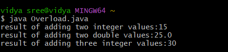

# java-lab-cse-g-5ef-2b
## experiment-2b 
# method overloading implementation 
Source code: 
java 
```


class Overload{
void add(int a , int b){
System.out.println("result of adding two integer values:" +(a + b));
}
void add(double a, double b){
System.out.println("result of adding two double values:" +(a + b));
}
void add(int a , int b , int c){
System.out.println("result of adding three integer values:"+(a + b + c));
}
public static void main (String [] args){
Overload obj = new Overload();
obj.add(5 , 10);
obj.add(5.5 , 19.5);
obj.add(5, 10,15);
}
}
```
# OUTPUT:


